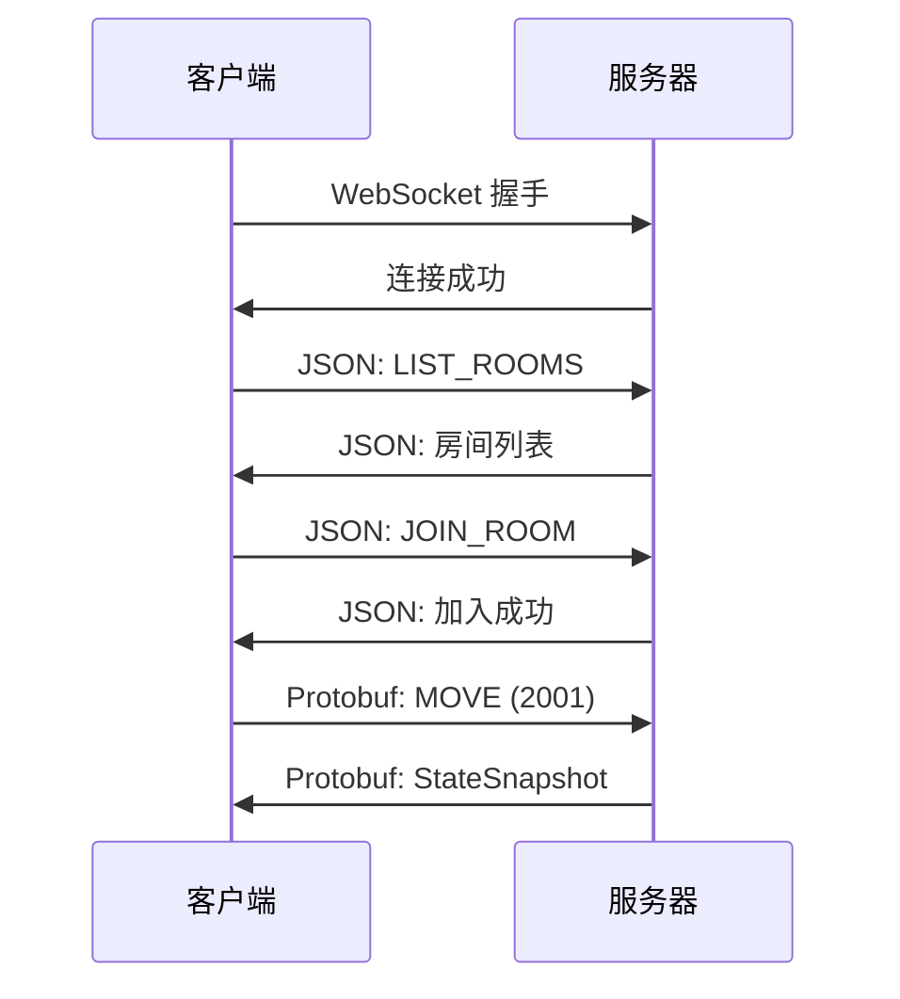

# WebSocket API 概述

Echo Trace 使用 WebSocket 进行客户端与服务器的实时通信，支持 **双协议模式**：

- **JSON（文本帧）**：房间管理操作
- **Protobuf（二进制帧）**：游戏数据传输

## 连接信息

### 服务器地址
```
ws://localhost:8080/ws
```

### 生产环境
```
wss://your-domain.com/ws
```

## 连接流程



## 消息类型

### JSON 消息（房间管理）

#### C2S（客户端 → 服务器）
| 类型 | 描述 | 参数 |
|------|------|------|
| `LIST_ROOMS` | 查询房间列表 | 无 |
| `CREATE_ROOM` | 创建房间 | `room_name`, `max_players`, `config` |
| `JOIN_ROOM` | 加入房间 | `room_id`, `player_name` |
| `LEAVE_ROOM` | 离开房间 | 无 |
| `RECONNECT` | 断线重连 | `session_id` |

#### S2C（服务器 → 客户端）
| 类型 | 描述 | 数据 |
|------|------|------|
| `ROOM_LIST` | 房间列表 | `rooms[]` |
| `ROOM_CREATED` | 房间创建成功 | `room_id`, `session_id` |
| `JOINED` | 加入成功 | `session_id`, `room_id` |
| `ERROR` | 错误消息 | `message` |

### Protobuf 消息（游戏数据）

详见 [Protobuf 协议](/protobuf/) 章节。

#### C2S 消息类型
| 消息类型 | 代码 | 描述 |
|---------|------|------|
| `MOVE` | 2001 | 移动/朝向更新 |
| `FIRE` | 2010 | 射击 |
| `USE_ITEM` | 2002 | 使用道具 |
| `INTERACT` | 2003 | 交互（引擎/商人） |
| `PICKUP` | 2004 | 拾取物品 |
| `DROP` | 2005 | 丢弃物品 |
| `SELL` | 2006 | 出售物品 |
| `BUY` | 2007 | 购买物品 |
| `SHOP_REFRESH` | 2008 | 刷新商店 |
| `CHOOSE_TACTIC` | 2009 | 选择战术 |

#### S2C 消息类型
| 消息类型 | 代码 | 描述 |
|---------|------|------|
| `STATE_SNAPSHOT` | 3001 | 游戏状态快照（每 50ms） |

## 错误处理

### 错误代码

| 代码 | 描述 | 解决方案 |
|------|------|---------|
| `ROOM_NOT_FOUND` | 房间不存在 | 检查 room_id 是否正确 |
| `ROOM_FULL` | 房间已满 | 选择其他房间或等待 |
| `INVALID_SESSION` | 无效的会话 | 重新连接或创建新会话 |
| `GAME_STARTED` | 游戏已开始 | 无法加入进行中的游戏 |
| `DUPLICATE_NAME` | 玩家名重复 | 更改玩家名 |

### 示例

```json
{
  "type": "ERROR",
  "message": "ROOM_FULL",
  "details": "房间玩家已达上限 (10/10)"
}
```

## 断线重连

### 重连窗口
- 断线后有 **30 秒**宽限期
- 超时后玩家会被踢出房间

### 重连流程

```javascript
// 保存 sessionID
let sessionID = null;

ws.onmessage = (event) => {
  const data = JSON.parse(event.data);
  if (data.type === 'JOINED') {
    sessionID = data.session_id;
    localStorage.setItem('sessionID', sessionID);
  }
};

// 断线后重连
ws.onclose = () => {
  const savedSessionID = localStorage.getItem('sessionID');
  if (savedSessionID) {
    const newWs = new WebSocket('ws://localhost:8080/ws');
    newWs.onopen = () => {
      newWs.send(JSON.stringify({
        type: 'RECONNECT',
        session_id: savedSessionID
      }));
    };
  }
};
```

## 心跳机制

### Ping/Pong
- 服务器每 **30 秒**发送 Ping 帧
- 客户端需自动响应 Pong 帧
- 连续 **3 次**无响应将断开连接

### 实现示例

```python
import websocket

def on_ping(ws, message):
    print("收到 Ping，自动回复 Pong")
    # websocket-client 库自动处理

ws = websocket.WebSocketApp(
    "ws://localhost:8080/ws",
    on_ping=on_ping
)
ws.run_forever(ping_interval=25, ping_timeout=10)
```

## 性能优化

### 带宽占用（v1.3.0）

| 协议 | 快照大小（10 玩家） | 带宽（20Hz） |
|------|-------------------|-------------|
| JSON | ~8 KB | 160 KB/s |
| **Protobuf** | **~2 KB** | **40 KB/s** ⬇️ 75% |

### 延迟优化
- Tick Rate: **50ms**（20 Hz）
- 客户端预测：支持（可选）
- 插值平滑：推荐 100-150ms

## 安全考虑

### 输入验证
- 所有客户端输入在服务器端验证
- 防止速度作弊：最大移动速度限制
- 防止射速作弊：冷却时间服务器验证

### 反作弊
- 视野验证：服务器仅推送可见实体
- 操作频率限制：防止 DDoS 攻击
- 会话令牌：防止会话劫持

## 下一步

- [房间管理 API](/api/room-management.html)
- [游戏操作 API](/api/game-actions.html)
- [状态快照格式](/api/state-snapshot.html)
