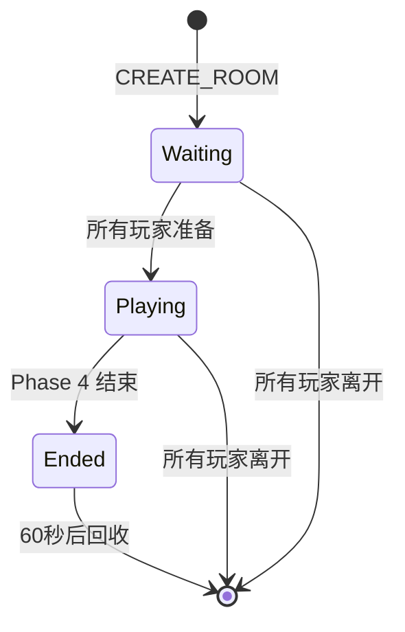

# 房间管理 API

房间管理使用 **JSON 文本帧**进行通信。

## 查询房间列表

### 请求

```json
{
  "type": "LIST_ROOMS"
}
```

### 响应

```json
{
  "type": "ROOM_LIST",
  "rooms": [
    {
      "room_id": "room_abc123",
      "room_name": "测试房间1",
      "player_count": 5,
      "max_players": 10,
      "status": "waiting",
      "map_size": "100x100",
      "created_at": "2026-01-12T10:30:00Z"
    }
  ]
}
```

### 字段说明

| 字段 | 类型 | 描述 |
|------|------|------|
| `room_id` | string | 房间唯一标识 |
| `room_name` | string | 房间名称 |
| `player_count` | int | 当前玩家数 |
| `max_players` | int | 最大玩家数 |
| `status` | string | 房间状态（`waiting`/`playing`/`ended`） |
| `map_size` | string | 地图尺寸 |

---

## 创建房间

### 请求

```json
{
  "type": "CREATE_ROOM",
  "room_name": "我的房间",
  "max_players": 8,
  "config": {
    "map": {
      "width": 100,
      "height": 100,
      "wall_density": 0.15
    },
    "phases": {
      "phase_1": {
        "duration_sec": 300
      },
      "phase_2": {
        "duration_sec": 300,
        "pulse_interval_sec": 15,
        "pulse_active_window_sec": 5
      },
      "phase_3": {
        "duration_sec": 120
      }
    },
    "items": {
      "respawn_interval_sec": 5.0,
      "max_items_per_phase": {
        "phase_1": 20,
        "phase_2": 15,
        "phase_3": 10
      }
    }
  }
}
```

### 响应

```json
{
  "type": "ROOM_CREATED",
  "room_id": "room_abc123",
  "session_id": "session_xyz789",
  "message": "房间创建成功"
}
```

### 配置参数详解

#### 地图配置（`config.map`）

| 参数 | 类型 | 默认值 | 描述 |
|------|------|--------|------|
| `width` | int | 100 | 地图宽度（50-200） |
| `height` | int | 100 | 地图高度（50-200） |
| `wall_density` | float | 0.15 | 墙壁密度（0.1-0.3） |

#### 阶段配置（`config.phases`）

**Phase 1（搜索阶段）**

| 参数 | 类型 | 默认值 | 描述 |
|------|------|--------|------|
| `duration_sec` | int | 300 | 阶段时长（秒） |

**Phase 2（冲突阶段）**

| 参数 | 类型 | 默认值 | 描述 |
|------|------|--------|------|
| `duration_sec` | int | 300 | 阶段时长 |
| `pulse_interval_sec` | int | 15 | 雷达脉冲间隔 |
| `pulse_active_window_sec` | int | 5 | 脉冲持续时间 |

**Phase 3（逃离阶段）**

| 参数 | 类型 | 默认值 | 描述 |
|------|------|--------|------|
| `duration_sec` | int | 120 | 阶段时长 |

#### 道具配置（`config.items`）

| 参数 | 类型 | 默认值 | 描述 |
|------|------|--------|------|
| `respawn_interval_sec` | float | 5.0 | 道具重生间隔 |
| `max_items_per_phase` | object | 见上 | 各阶段最大道具数 |

---

## 加入房间

### 请求

```json
{
  "type": "JOIN_ROOM",
  "room_id": "room_abc123",
  "player_name": "玩家1"
}
```

### 响应

```json
{
  "type": "JOINED",
  "session_id": "session_xyz789",
  "room_id": "room_abc123",
  "message": "成功加入房间"
}
```

### 错误响应

```json
{
  "type": "ERROR",
  "message": "ROOM_FULL",
  "details": "房间已满 (10/10)"
}
```

---

## 离开房间

### 请求

```json
{
  "type": "LEAVE_ROOM"
}
```

### 响应

```json
{
  "type": "LEFT",
  "message": "已离开房间"
}
```

---

## 断线重连

### 请求

```json
{
  "type": "RECONNECT",
  "session_id": "session_xyz789"
}
```

### 响应（成功）

```json
{
  "type": "RECONNECTED",
  "room_id": "room_abc123",
  "message": "重连成功"
}
```

### 响应（失败）

```json
{
  "type": "ERROR",
  "message": "INVALID_SESSION",
  "details": "会话已过期或无效"
}
```

---

## 房间生命周期



### 自动回收机制

| 条件 | 回收延迟 |
|------|---------|
| 游戏结束（Phase 4） | 60 秒 |
| 所有玩家离开 | 立即 |
| 房间空闲超时 | 300 秒 |

---

## 示例代码

### JavaScript

```javascript
const ws = new WebSocket('ws://localhost:8080/ws');

// 查询房间列表
ws.send(JSON.stringify({ type: 'LIST_ROOMS' }));

// 创建房间
ws.send(JSON.stringify({
  type: 'CREATE_ROOM',
  room_name: '测试房间',
  max_players: 10
}));

// 加入房间
ws.send(JSON.stringify({
  type: 'JOIN_ROOM',
  room_id: 'room_abc123',
  player_name: '玩家1'
}));
```

### Python

```python
import json
import websocket

ws = websocket.WebSocket()
ws.connect("ws://localhost:8080/ws")

# 查询房间列表
ws.send(json.dumps({"type": "LIST_ROOMS"}))
response = json.loads(ws.recv())
print(response["rooms"])

# 创建房间
ws.send(json.dumps({
    "type": "CREATE_ROOM",
    "room_name": "测试房间",
    "max_players": 10
}))
```

---

## 下一步

- [游戏操作 API](/api/game-actions.html)
- [状态快照](/api/state-snapshot.html)
