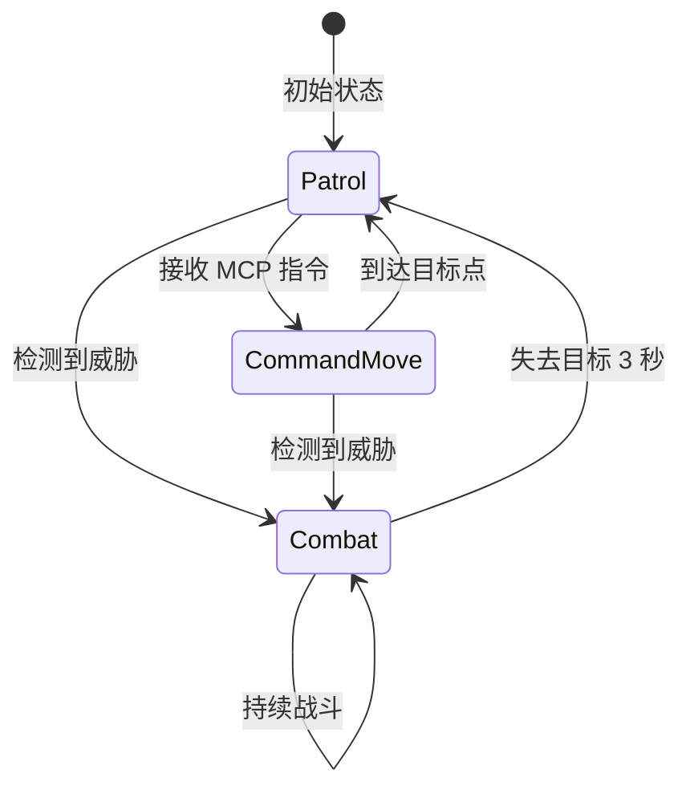

# AI Boss：柠白号 (NingBye)

柠白号是 Echo Trace 中的 AI Boss，在 Phase 1-3 阶段持续威胁玩家。其行为基于 **A* 寻路** 和 **行为树状态机**。

## 基础属性

| 属性 | 数值 | 说明 |
|------|------|------|
| **HP** | 300 | 是普通玩家的 3 倍 |
| **护甲** | 150 | 高护甲，推荐使用穿甲弹 |
| **移动速度** | 4.0 m/s | 比玩家慢 20% |
| **伤害** | 40 | 单发伤害是玩家的 1.6 倍 |
| **护甲穿透** | 30% | 无视 30% 护甲值 |
| **装填速度** | 0.25 秒 | 是玩家的 2 倍 |
| **感知半径** | 15.0 m | 可感知半径内的玩家 |

---

## 行为状态机

柠白号有 **3 种行为状态**，根据感知结果动态切换。

### 状态图



---

### 状态 0: 巡逻模式 (Patrol)

**触发条件**：
- 初始状态
- 失去战斗目标超过 3 秒
- 完成 MCP 移动指令

**行为逻辑**：
1. **随机游走**：选择相邻的可行走单元格作为目标
2. **路径规划**：使用 BFS 算法寻找路径
3. **移动执行**：沿路径移动，到达后重新选择目标

**代码实现**：
```go
// backend/logic/ai_ningbye.go
func (gs *GameState) aiMoveBehavior(ent *Entity, data *NingByeAI, dt float64) {
    if len(data.PatrolPath) == 0 {
        // 选择随机相邻格子
        candidates := []Vector2{}
        for dy := -1; dy <= 1; dy++ {
            for dx := -1; dx <= 1; dx++ {
                if dx == 0 && dy == 0 {
                    continue
                }
                nx, ny := currX+dx, currY+dy
                if gs.Map.IsWalkable(float64(nx), float64(ny)) {
                    candidates = append(candidates, Vector2{X: float64(nx) + 0.5, Y: float64(ny) + 0.5})
                }
            }
        }
        if len(candidates) > 0 {
            next := candidates[rand.Intn(len(candidates))]
            data.PatrolPath = []Vector2{next}
        }
    }
    
    // 沿路径移动
    if len(data.PatrolPath) > 0 {
        target := data.PatrolPath[0]
        moveDist := data.MoveSpeed * dt
        // 移动逻辑...
    }
}
```

**视觉特征**：
- 缓慢移动，不固定路线
- 炮塔随机转向
- 无攻击动作

---

### 状态 1: 指令移动 (CommandMove)

**触发条件**：
- 接收 MCP 指令 `COMMAND_AI_MOVE`
- 玩家使用 **"开发者遗忘的命令行"** (T4) 下达指令

**行为逻辑**：
1. **目标设定**：接收目标坐标 `(targetX, targetY)`
2. **路径规划**：使用 A* 算法寻找最优路径
3. **移动执行**：沿路径快速移动
4. **到达检测**：距离目标 < 0.5m 时切换回巡逻模式

**代码实现**：
```go
func (gs *GameState) CommandAI(targetX, targetY float64) bool {
    // 找到 AI 实体
    for uid, e := range gs.Entities {
        if e.Type == EntityTypeNingBye {
            data := e.Extra.(NingByeAI)
            data.State = AIStateCommandMove
            data.TargetPos = Vector2{X: targetX, Y: targetY}
            data.PatrolPath = nil // 强制重新规划路径
            e.Extra = data
            gs.Entities[uid] = e
            return true
        }
    }
    return false
}
```

**MCP 指令示例**：
```json
{
  "action": "command_ai_move",
  "params": {
    "target_x": 50.0,
    "target_y": 50.0
  }
}
```

**视觉特征**：
- 快速移动（速度提升 20%）
- 炮塔朝向目标方向
- 路径上出现引导线（仅开发模式）

---

### 状态 2: 战斗模式 (Combat)

**触发条件**：
- 感知半径内检测到威胁玩家
- 玩家距离 < 3.0m（自卫机制）

**行为逻辑**：
1. **目标锁定**：选择感知半径内最近的威胁玩家
2. **视线检查**：使用光线投射检查是否有视线（Line of Sight）
3. **瞄准射击**：计算弹道，发射子弹
4. **失去目标**：目标离开感知半径或失去视线超过 3 秒后退出战斗

**威胁判定**：
```go
func (gs *GameState) scanForThreat(pos Vector2, radius float64) *Player {
    // 使用四叉树加速查询
    if gs.Quadtree != nil {
        nearbyEntities := gs.Quadtree.QueryRadius(pos.X, pos.Y, radius)
        for _, e := range nearbyEntities {
            if p, ok := gs.Players[e.UID]; ok && p.IsAlive && !p.IsExtracted {
                // 条件 1: 明确威胁标记
                isTarget := p.IsThreat && dist2 <= minDist
                
                // 条件 2: 过近触发自卫（< 3.0m）
                if !isTarget && dist2 <= 9.0 {
                    isTarget = true
                }
                
                // 视线检查
                if isTarget && gs.hasLOS(pos, p.Pos) {
                    return p
                }
            }
        }
    }
    return nil
}
```

**射击机制**：
```go
func (gs *GameState) aiCombatBehavior(ent *Entity, data *NingByeAI, target *Player, now time.Time) {
    // 检查装填时间
    if now.Sub(data.LastFireTime).Seconds() < data.ReloadTimeSec {
        return
    }
    
    data.LastFireTime = now
    
    // 计算弹道
    dir := Vector2{X: target.Pos.X - ent.Pos.X, Y: target.Pos.Y - ent.Pos.Y}
    dist := math.Sqrt(dir.X*dir.X + dir.Y*dir.Y)
    if dist > 0 {
        dir.X /= dist
        dir.Y /= dist
    }
    
    // 创建子弹实体
    proj := ProjectileData{
        OwnerID:          "AI_NINGBYE",
        Velocity:         Vector2{X: dir.X * 12.0, Y: dir.Y * 12.0},
        Damage:           data.Damage,           // 40
        ArmorPenetration: data.ArmorPenetration, // 30%
        Lifetime:         now.Add(5 * time.Second),
    }
    
    gs.Entities[NewUID()] = Entity{
        UID:   uid,
        Type:  EntityTypeProjectile,
        Pos:   Vector2{X: ent.Pos.X + dir.X*0.8, Y: ent.Pos.Y + dir.Y*0.8},
        Extra: proj,
    }
}
```

**视觉特征**：
- 炮塔快速转向目标
- 频繁开火（0.25 秒间隔）
- 橙色子弹特效（区别于玩家子弹）

---

## 感知系统

### 威胁检测

柠白号通过两种方式检测威胁：

#### 1. 明确威胁标记 (IsThreat)

玩家触发以下行为会被标记为威胁：
- 攻击柠白号
- 使用 **"全境扫描终端"** (T3) 锁定柠白号
- 距离 < 3.0m 触发自卫机制

**标记方式**（MCP 指令）：
```json
{
  "action": "set_threat",
  "params": {
    "session_id": "player_123",
    "is_threat": true
  }
}
```

**清除标记**：
- 玩家死亡
- 玩家撤离
- 距离 > 感知半径 持续 10 秒

---

#### 2. 自卫机制 (Proximity Defense)

任何玩家距离 < 3.0m 时，自动触发战斗模式，无需威胁标记。

**代码逻辑**：
```go
// 条件 2: 过近触发自卫（< 3.0m）
if !isTarget && dist2 <= 9.0 {  // dist2 = 距离的平方
    isTarget = true
}
```

---

### 视线检查 (Line of Sight)

即使检测到威胁，柠白号也需要视线才能攻击。

**LOS 算法**（光线投射）：
```go
func (gs *GameState) hasLOS(from, to Vector2) bool {
    // DDA 光线投射算法
    dx := to.X - from.X
    dy := to.Y - from.Y
    steps := int(math.Max(math.Abs(dx), math.Abs(dy)))
    
    for i := 1; i <= steps; i++ {
        t := float64(i) / float64(steps)
        checkX := from.X + dx*t
        checkY := from.Y + dy*t
        
        if !gs.Map.IsWalkable(checkX, checkY) {
            return false  // 被墙体阻挡
        }
    }
    return true
}
```

**LOS 阻挡物**：
- 墙体（TileWall）
- 不可通过的实体（未实现）

---

## 路径规划

### BFS 算法（巡逻模式）

用于短距离随机移动，性能优先。

```go
func (gs *GameState) findPath(start, end Vector2) []Vector2 {
    queue := []Point{{sx, sy}}
    cameFrom := make(map[Point]Point)
    
    // 最大搜索步数：500
    steps := 0
    for len(queue) > 0 && steps < 500 {
        curr := queue[0]
        queue = queue[1:]
        steps++
        
        if curr.X == ex && curr.Y == ey {
            found = true
            break
        }
        
        // 4 方向邻居（上下左右）
        dirs := []Point{{0, 1}, {0, -1}, {1, 0}, {-1, 0}}
        for _, d := range dirs {
            next := Point{curr.X + d.X, curr.Y + d.Y}
            if _, visited := cameFrom[next]; !visited {
                if gs.Map.IsWalkable(float64(next.X), float64(next.Y)) {
                    cameFrom[next] = curr
                    queue = append(queue, next)
                }
            }
        }
    }
    
    // 重建路径
    return reconstructPath(cameFrom, start, end)
}
```

---

### A* 算法（指令移动）

用于长距离精确导航，路径最优。

**启发式函数**（曼哈顿距离）：
```go
func heuristic(a, b Point) float64 {
    return math.Abs(float64(a.X-b.X)) + math.Abs(float64(a.Y-b.Y))
}
```

**代码实现**：
```go
type node struct {
    X, Y   int
    G, H   float64  // G: 起点距离, H: 目标距离
    Parent *node
}

func (gs *GameState) findPathAStar(start, end Vector2) []Vector2 {
    openSet := []*node{{X: sx, Y: sy, G: 0, H: heuristic(Point{sx, sy}, Point{ex, ey})}}
    closedSet := make(map[Point]bool)
    
    for len(openSet) > 0 {
        // 选择 F = G + H 最小的节点
        current := popMinF(openSet)
        
        if current.X == ex && current.Y == ey {
            return reconstructPath(current)
        }
        
        closedSet[Point{current.X, current.Y}] = true
        
        // 扩展邻居
        for _, neighbor := range getNeighbors(current) {
            if closedSet[Point{neighbor.X, neighbor.Y}] {
                continue
            }
            
            tentativeG := current.G + 1
            if tentativeG < neighbor.G {
                neighbor.Parent = current
                neighbor.G = tentativeG
                neighbor.H = heuristic(Point{neighbor.X, neighbor.Y}, Point{ex, ey})
                openSet = append(openSet, neighbor)
            }
        }
    }
    
    return nil  // 无路径
}
```

---

## 性能优化

### 四叉树空间索引

使用四叉树加速感知系统查询，避免遍历所有玩家。

**查询优化**：
```go
// 旧代码：O(N) 遍历所有玩家
for _, p := range gs.Players {
    dist := Distance(pos, p.Pos)
    if dist < radius {
        candidates = append(candidates, p)
    }
}

// 新代码：O(log N) 四叉树查询
nearbyEntities := gs.Quadtree.QueryRadius(pos.X, pos.Y, radius)
for _, e := range nearbyEntities {
    if p, ok := gs.Players[e.UID]; ok {
        candidates = append(candidates, p)
    }
}
```

**性能提升**：
- 10 玩家：提升 50%
- 20 玩家：提升 75%
- 50 玩家：提升 90%

详见 [空间索引](/game-logic/spatial-indexing.html)。

---

## 阶段变化

柠白号的行为在不同阶段有所调整：

| 阶段 | 移动速度 | 伤害 | 感知半径 | 雷达频率 | 特殊行为 |
|------|---------|------|---------|---------|---------|
| **Phase 1** | 4.0 m/s | 40 | 15.0 m | 30 秒 | 被动巡逻 |
| **Phase 2** | 4.8 m/s | 40 | 18.0 m | 25 秒 | 主动追击 |
| **Phase 3** | 5.2 m/s | 50 | 20.0 m | 20 秒 | 守点战术 |

**Phase 2 变化**：
- 移动速度 +20%
- 感知半径 +20%
- 雷达脉冲频率提升

**Phase 3 变化**：
- 移动速度 +30%
- 伤害 +25%
- 感知半径 +33%
- 倾向于守在撤离点附近

---

## 对抗策略

### 玩家视角

#### 躲避技巧
1. **保持距离**：≥ 15m 避免被感知
2. **利用视线遮挡**：躲在墙后破坏 LOS
3. **听声辨位**：柠白号有独特的引擎声

#### 击杀策略
1. **使用穿甲弹**：**"超级穿甲弹"** (T1) 无视护甲
2. **跨墙狙击**：**"超视距·电磁炮"** (T3) 穿墙攻击
3. **团队协作**：多人同时攻击（300 HP 需要 8-12 发子弹）
4. **轨道打击**：**"精通天理"** (T4) 一击 125 伤害

#### 利用 AI
- 引导柠白号攻击其他玩家
- 利用柠白号清理区域
- 使用 **"开发者遗忘的命令行"** (T4) 控制移动

---

### 开发者调试

#### MCP 指令

**移动控制**：
```json
{
  "action": "command_ai_move",
  "params": {
    "target_x": 50.0,
    "target_y": 50.0
  }
}
```

**威胁标记**：
```json
{
  "action": "set_threat",
  "params": {
    "session_id": "player_123",
    "is_threat": true
  }
}
```

**状态查询**：
```json
{
  "action": "query_ai_state"
}
```

**响应示例**：
```json
{
  "success": true,
  "state": {
    "ai_state": 2,  // 0: Patrol, 1: CommandMove, 2: Combat
    "position": {"x": 45.5, "y": 67.2},
    "target_id": "player_123",
    "hp": 250,
    "last_fire_time": 1234567890
  }
}
```

---

## 配置参数

**后端配置** (`config/ai.json`):
```json
{
  "ai": {
    "ning_bye": {
      "hp": 2000.0,
      "armor": 50.0,
      "move_speed": 5.0,
      "damage": 50.0,
      "armor_penetration": 0.5,
      "reload_time_sec": 1.5,
      "sensing_radius_ratio": 1.5,
      "lost_target_timeout_sec": 3.0
    }
  }
}
```

---

## 下一步

- [空间索引](/game-logic/spatial-indexing.html) - 四叉树实现详解
- [游戏阶段](/game-logic/phases.html) - Phase 1-3 AI 行为变化
- [道具系统](/game-logic/items.html) - 对抗 AI 的道具推荐
