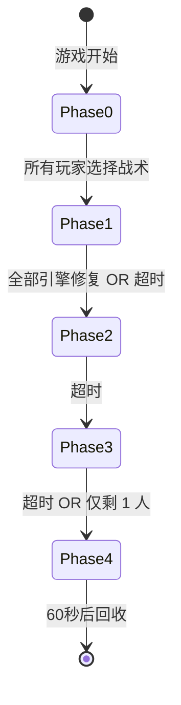

# 游戏阶段系统

Echo Trace 采用 **5 阶段**游戏流程设计，每个阶段有独特的玩法机制和战术选择。

## 阶段概览

| 阶段 | 代码 | 名称 | 默认时长 | 核心机制 |
|------|------|------|---------|---------|
| Phase 0 | `PhaseInit` | 战术选择 | 无限制 | 选择永久加成 |
| Phase 1 | `PhaseSearch` | 搜索阶段 | 5 分钟 | 收集资源，修复引擎 |
| Phase 2 | `PhaseConflict` | 冲突阶段 | 5 分钟 | 雷达脉冲，PvP |
| Phase 3 | `PhaseEscape` | 逃离阶段 | 2 分钟 | 地图缩圈，撤离 |
| Phase 4 | `PhaseEnded` | 游戏结束 | 60 秒 | 统计结算 |

## Phase 0: 战术选择

### 阶段目标
每位玩家选择一种**战术倾向**，获得永久属性加成。

### 可选战术

| 战术 | 代码 | 效果 | 适用玩家 |
|------|------|------|---------|
| 侦察 | `RECON` | 视野半径 +20% | 信息优势，远程骚扰 |
| 生存 | `DEFENSE` | 最大生命值 +20% | 正面对抗，持久战 |
| 攻击 | `TRAP` | 护甲穿透 +20% | 高伤害输出，刺客 |

### 操作方式
- 按下 **数字键 1-3** 选择战术
- 无时间限制，但无法更改
- 所有玩家完成选择后自动进入 Phase 1

### 战术策略建议

**RECON（侦察）**
- 优势：提前发现敌人，规避战斗
- 道具推荐：全境扫描终端、光锥之外
- 战术：边缘游走，信息侦察

**DEFENSE（生存）**
- 优势：容错率高，适合新手
- 道具推荐：回光返照、绝对防御
- 战术：正面对抗，守点控场

**TRAP（攻击）**
- 优势：快速击杀，雪球滚动
- 道具推荐：超级穿甲弹、精通天理
- 战术：游击战，快速击杀撤退

---

## Phase 1: 搜索阶段

### 阶段目标
- 搜刮物资（护盾、弹药、道具）
- 修复全部引擎（通过 F 键交互）
- 与商人交易升级装备
- 躲避 AI Boss "柠白号"

### 关键机制

#### 引擎系统
- 地图生成 **6 个引擎**
- 每个引擎需修复进度 100%
- 修复速度：2%/秒（50 秒完成）
- 多人同时修复：速度叠加

#### 物资生成
- 地面掉落物：最多 20 个
- 重生间隔：5 秒
- 道具稀有度权重：
  - T1: 60%
  - T2: 25%
  - T3: 12%
  - T4: 3%

#### 商人交易
- 固定位置生成
- 出售道具：获得 Credits
- 购买道具：消耗 Credits
- 刷新商店：100 Credits（Phase 1 免费一次）

### 生存技巧
- 优先修复引擎推进游戏
- 听声辨位：柠白号有独特音效
- 保持移动：避免被 AI 锁定
- 收集 T2+ 道具备战 Phase 2

---

## Phase 2: 冲突阶段

### 阶段目标
- 竞争稀缺物资
- 高强度 PvP 与 PvE
- 积累 Credits 和装备优势

### 关键机制

#### 雷达脉冲
- 触发间隔：15 秒
- 持续时间：5 秒
- 效果：所有玩家位置在小地图上显示
- 反制：使用"全频段阻塞干扰"（T4）

#### 物资调整
- 地面掉落物：最多 15 个
- 道具稀有度权重：
  - T1: 40%
  - T2: 30%
  - T3: 20%
  - T4: 10%

#### AI 加强
- 柠白号移动速度 +20%
- 雷达脉冲频率提升（30 秒 → 25 秒）
- 更具攻击性的追击逻辑

### 战术建议
- **进攻型**：利用雷达脉冲主动狩猎
- **防守型**：守在商人附近交易
- **游击型**：打一枪换一个地方
- **隐蔽型**：使用"无形之物"隐身

---

## Phase 3: 逃离阶段

### 阶段目标
- 到达撤离点
- 按 **F 键**完成撤离
- 成为最后的幸存者

### 关键机制

#### 地图缩圈
- 从地图边缘开始收缩
- 收缩速度：1 单位/秒
- 伤害区：10 伤害/秒（无视护甲）

#### 撤离点
- 随机位置生成
- 撤离需要 **3 秒**交互时间
- 被打断会重置进度
- 撤离后进入旁观模式

#### 物资调整
- 地面掉落物：最多 10 个
- 道具稀有度权重：
  - T1: 20%
  - T2: 30%
  - T3: 30%
  - T4: 20%

### 生存策略
- **早撤离**：安全但低收益
- **晚撤离**：击杀更多玩家获得奖励
- **守点战术**：埋伏撤离点
- **闪灵瞬步**：快速逃离危险

---

## Phase 4: 游戏结束

### 统计数据

| 数据 | 描述 |
|------|------|
| 存活时间 | 从 Phase 1 开始计时 |
| 击杀数 | 击败的玩家数量 |
| 伤害输出 | 总伤害量 |
| 道具使用 | 使用的 T3+ 道具数量 |
| 收益 | 获得的 Credits |

### 房间回收
- 游戏结束后 **60 秒**自动关闭房间
- 玩家可查看统计数据
- 断线玩家数据仍保留

---

## 阶段转换流程



## 开发者接口

### 获取当前阶段

**StateSnapshot 字段**:
```protobuf
message StateSnapshot {
  int32 phase = 1;        // 0-4
  float time_left = 2;    // 剩余时间（秒）
}
```

### 强制跳过阶段（开发者指令）

```json
{
  "type": "DEV_SKIP_PHASE"
}
```

仅在开发模式下可用。

## 下一步

- [道具系统](/game-logic/items.html)
- [AI Boss 行为](/game-logic/ai-boss.html)
