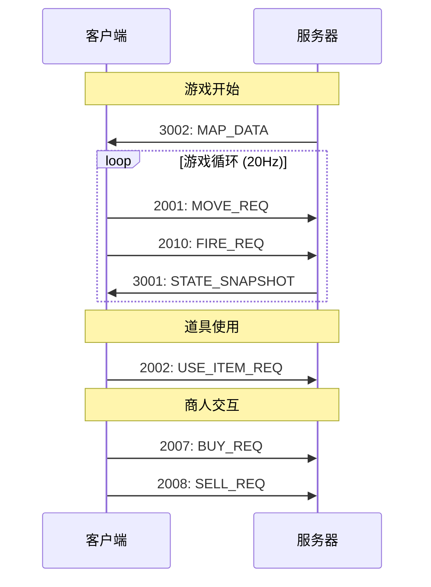

# 消息类型完整目录

本页面列出 Echo Trace 协议中所有 Protobuf 消息类型及其类型代码。

## 消息封装

所有 Protobuf 消息都通过 `Envelope` 封装：

```protobuf
message Envelope {
  int32 type = 1;      // 消息类型代码
  bytes payload = 2;   // 序列化后的消息体
}
```

---

## C2S 消息（客户端 → 服务器）

### 游戏操作类

| 类型代码 | 消息名称 | Protobuf 类型 | 描述 | 使用场景 |
|---------|----------|--------------|------|----------|
| **2001** | MOVE_REQ | `MoveInput` | 移动/朝向 | 每帧发送 |
| **2010** | FIRE_REQ | `bool` | 射击 | 按空格键触发 |
| **2002** | USE_ITEM_REQ | `UseItemInput` | 使用道具 | 快捷键 1-6 |
| **2003** | INTERACT_REQ | `bool` | 交互（修引擎/撤离） | 按 F 键 |
| **2004** | PICKUP_REQ | `bool` | 拾取物品 | 按 E 键 |
| **2005** | DROP_REQ | `DropInput` | 丢弃道具 | Ctrl+1-6 |

### 战术/商店类

| 类型代码 | 消息名称 | Protobuf 类型 | 描述 | 使用场景 |
|---------|----------|--------------|------|----------|
| **2006** | CHOOSE_TACTIC_REQ | `TacticInput` | 选择战术 | Phase 0 |
| **2007** | BUY_REQ | `BuyInput` | 购买道具 | 商人交互 |
| **2008** | SELL_REQ | `SellInput` | 出售道具 | 商人交互 |
| **2009** | SHOP_REFRESH_REQ | `bool` | 刷新商店 | 商人交互 |

### 开发者指令

| 类型代码 | 消息名称 | Protobuf 类型 | 描述 | 使用场景 |
|---------|----------|--------------|------|----------|
| **2099** | DEV_SKIP_PHASE | `bool` | 跳过阶段 | 仅开发模式 |

---

## S2C 消息（服务器 → 客户端）

### 游戏状态类

| 类型代码 | 消息名称 | Protobuf 类型 | 描述 | 频率 |
|---------|----------|--------------|------|------|
| **3001** | STATE_SNAPSHOT | `StateSnapshot` | 完整状态快照 | 20Hz (每 50ms) |
| **3002** | MAP_DATA | `MapData` | 地图数据 | 游戏开始时一次 |

---

## Protobuf 消息结构

### MoveInput

```protobuf
message MoveInput {
  Vector2 dir = 1;          // 移动方向（-1 到 1）
  Vector2 look_dir = 2;     // 朝向方向（单位向量）
  bool has_look_dir = 3;    // 是否指定朝向
}
```

**使用示例**：
```python
move_input = pb.MoveInput(
    dir=pb.Vector2(x=1.0, y=0.0),
    look_dir=pb.Vector2(x=0.707, y=0.707),
    has_look_dir=True
)
```

---

### UseItemInput

```protobuf
message UseItemInput {
  int32 slot_index = 1;  // 物品栏索引（0-5）
}
```

**使用示例**：
```python
use_item = pb.UseItemInput(slot_index=0)  # 使用第 1 个道具
```

---

### DropInput

```protobuf
message DropInput {
  int32 slot_index = 1;  // 物品栏索引（0-5）
}
```

---

### TacticInput

```protobuf
message TacticInput {
  string tactic = 1;  // "RECON" | "DEFENSE" | "TRAP"
}
```

**使用示例**：
```python
tactic = pb.TacticInput(tactic="RECON")
```

---

### BuyInput

```protobuf
message BuyInput {
  string item_id = 1;  // 商店道具 ID
}
```

---

### SellInput

```protobuf
message SellInput {
  int32 slot_index = 1;  // 物品栏索引（0-5）
}
```

---

### StateSnapshot

完整状态快照，包含当前游戏所有可见信息。

```protobuf
message StateSnapshot {
  int32 phase = 1;                     // 游戏阶段（0-4）
  double time_left = 2;                // 剩余时间（秒）
  int32 total_kills = 3;               // 总击杀数
  bool jammer_active = 4;              // 干扰器激活状态
  
  PlayerSnapshot my_state = 5;         // 自己的状态
  repeated PlayerSnapshot other_players = 6;  // 可见的其他玩家
  repeated EntitySnapshot entities = 7;       // 可见实体
  repeated RadarBlip radar_blips = 8;        // 雷达显示
  repeated GameEvent events = 9;             // 游戏事件
  
  repeated string shop_stock = 10;     // 商店库存（如果靠近商人）
  repeated int32 shop_prices = 11;     // 商店价格
  repeated string shop_types = 12;     // 商店道具类型
}
```

详细说明见 [状态快照 API](/api/state-snapshot.html)。

---

### PlayerSnapshot

```protobuf
message PlayerSnapshot {
  string session_id = 1;
  string name = 2;
  Vector2 pos = 3;
  Vector2 look_dir = 4;
  double hp = 5;
  double max_hp = 6;
  double armor = 7;
  double max_armor = 8;
  int32 kills = 9;
  bool is_alive = 10;
  repeated Item inventory = 11;
  int32 funds = 12;
  string client_msg = 13;
  string ammo_type = 14;
  int32 ammo_count = 15;
  int32 inventory_cap = 16;
}
```

---

### EntitySnapshot

```protobuf
message EntitySnapshot {
  string uid = 1;
  string type = 2;  // "motor" | "supply" | "projectile" | "ai_ningbye" | "evac"
  Vector2 pos = 3;
  int32 state = 4;
  bytes extra = 5;  // 类型特定数据（序列化）
}
```

**实体类型**：
- `motor`：引擎（可修复）
- `supply`：补给箱（可拾取）
- `projectile`：子弹（碰撞检测）
- `ai_ningbye`：AI Boss 柠白号
- `evac`：撤离点

---

### MapData

```protobuf
message MapData {
  int32 width = 1;
  int32 height = 2;
  repeated int32 tiles = 3;  // 地图瓦片（行优先数组）
  Vector2 spawn_pos = 4;
  repeated Item inventory = 5;  // 初始背包
}
```

---

## 通用类型

### Vector2

```protobuf
message Vector2 {
  double x = 1;
  double y = 2;
}
```

---

### Item

```protobuf
message Item {
  string id = 1;
  string type = 2;
  string name = 3;
  int32 max_uses = 4;
  int32 uses_left = 5;
  double weight = 6;
  int32 tier = 7;       // 稀有度（1-4）
  int32 value = 8;      // 售价
}
```

---

### RadarBlip

```protobuf
message RadarBlip {
  string type = 1;  // "player" | "ai" | "evac"
  Vector2 pos = 2;
}
```

---

### GameEvent

```protobuf
message GameEvent {
  string type = 1;  // "kill" | "phase" | "evac" | "item"
  string msg = 2;   // 事件描述
}
```

---

## 消息流程图



---

## 错误处理

如果服务器收到无效的 Protobuf 消息：
- **反序列化失败**：忽略消息，不断开连接
- **类型代码未知**：记录警告，忽略消息
- **字段验证失败**：使用默认值或拒绝操作

---

## 性能指标

| 消息类型 | JSON 大小 | Protobuf 大小 | 压缩率 |
|---------|----------|--------------|--------|
| MoveInput | ~80 bytes | ~16 bytes | 80% |
| StateSnapshot | ~2000 bytes | ~500 bytes | 75% |
| UseItemInput | ~40 bytes | ~8 bytes | 80% |

---

## 下一步

- [迁移指南](/protobuf/migration-guide.html) - 从 JSON 迁移到 Protobuf
- [游戏操作 API](/api/game-actions.html) - C2S 消息详细说明
- [状态快照 API](/api/state-snapshot.html) - StateSnapshot 结构详解
